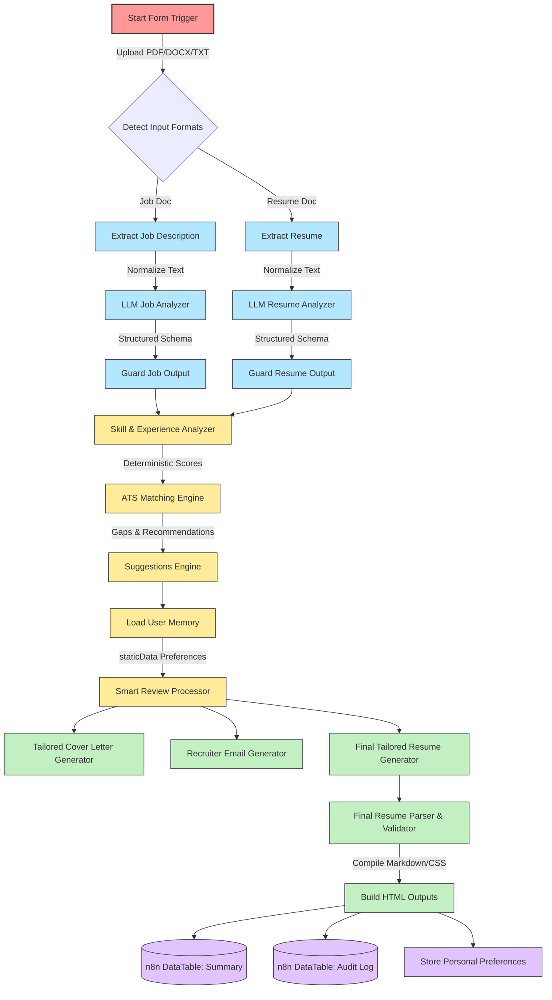

# 🤖 AI Job Application Assistant Suite (n8n Workflows)

A production-grade, autonomous recruitment agent suite powered by **n8n** and **OpenAI**. This pipeline automates the ingestion, parsing, comparison, personal memory personalization, and drafting of job application resources (resumes, cover letters, and recruiter emails).

---

## 📌 Architecture & Data Flow

This flowchart illustrates the multi-stage, dual-path parsing and reasoning architecture:

---

## 🌟 Key Capabilities

1. **Multi-Format Ingestion**: Automatic parsing for **PDF, DOCX, and plain TXT** files using n8n extraction modules with robust path safeguards.
2. **Dual-Branch Parallel Parsing**: Processes the candidate resume and job description in parallel. Employs independent fallback guard nodes to prevent `output` collisions before merging.
3. **Deterministic Score Calculation**: Programs custom JavaScript modules (BR-4, BR-5, BR-5b) to calculate exact year matching and skill overlap, preventing LLM math hallucinations.
4. **Context-Aware personal Memory (BR-2)**: Leverages n8n's local `staticData` variables to remember user choices, previous application feedback, and personal branding details across executions.
5. **Quality Assurance Validator (BR-7)**: Checks the synthesized resume against structural templates. Raises soft warnings or hard stops if critical elements (e.g., Contact Info, Target Skills) are missing.
6. **Structured Data Tables**: Records detailed application performance telemetry and security/event audit trails into n8n's embedded DataTable service.

---

## 📂 Repository Structure

The workflows are located under the `workflows/` directory:

- 📑 **[`resume_automation.json`](workflows/resume_automation.json)**: The core production-ready workflow. Utilizes structured JSON output schemas and optimized temperature settings for reliability and speed.
- 📑 **[`resume_automation_verbose_prompts.json`](workflows/resume_automation_verbose_prompts.json)**: A specialized variant equipped with highly detailed system prompt templates for complex, multi-industry resume alignment.

---

## ⚙️ Prerequisites & Setup

### 1. n8n Instance
Ensure you have n8n running (version **v1.0** or above).

### 2. OpenAI API Credentials
Both workflows require an active OpenAI API connection. 
- In your n8n dashboard, navigate to **Credentials** $\rightarrow$ **Add Credential** $\rightarrow$ Select **OpenAI**.
- Insert your `OpenAI API Key`.
- The workflows will automatically associate their nodes with your active OpenAI credential.

### 3. Setup Internal DataTables
This project uses two internal n8n DataTables for analytics and activity tracking. You must create these tables in your n8n instance prior to running the workflow.

#### Table 1: `application_summary`
Create a table named `application_summary` with the following columns:

| Column Name | Data Type | Description |
| :--- | :--- | :--- |
| `candidate_name` | String | Name of the candidate parsed from the resume |
| `job_role` | String | Target role parsed from the job description |
| `ats_score` | Number | Programmatic matching score (0-100) |
| `ats_confidence`| Number | AI confidence assessment score (0-100) |
| `verdict` | String | Recommendation verdict (e.g., Apply, Optimize) |
| `verdict_reason` | String | Contextual rationale for the verdict |
| `missing_skills` | String | List of skills present in job but missing in resume |
| `matched_skills` | String | List of skills matching between job and resume |
| `resume_version` | Number | Iteration version tracker |
| `resume_validation_passed` | Boolean | True if the output passed structural checks |
| `resume_validation_warnings` | String | Formatting alerts |
| `timestamp` | String | Date/Time of the calculation |

#### Table 2: `audit_log`
Create a table named `audit_log` with the following columns:

| Column Name | Data Type | Description |
| :--- | :--- | :--- |
| `event_type` | String | Type of event (e.g., Analysis, Generation) |
| `user_id` | String | Stable user identifier (Email or Name) |
| `job_role` | String | Target job title |
| `ats_score` | Number | Programmatic matching score (0-100) |
| `verdict` | String | Final decision suggestion |
| `resume_version` | Number | Generated version index |
| `accepted_count` | Number | Number of skills approved |
| `rejected_count` | Number | Number of skills flagged |
| `resume_validation_passed` | Boolean | Structural integrity status |
| `timestamp` | String | Time of event log |

---

## 🚀 Step-by-Step Import Guide

1. Clone or download this repository.
2. Open your **n8n dashboard**.
3. Create a new empty workflow.
4. Click the **Menu** (three dots) in the top-right corner and select **Import from File**.
5. Choose `workflows/resume_automation.json` (or the verbose prompts variant).
6. n8n will load all nodes. If requested, map the OpenAI LLM nodes to your configured OpenAI credentials.
7. Click **Save** and toggle the workflow to **Active** to deploy the Form Trigger interface.

---

## 🛡️ License

Distributed under the MIT License. See [`LICENSE`](LICENSE) for more information.
